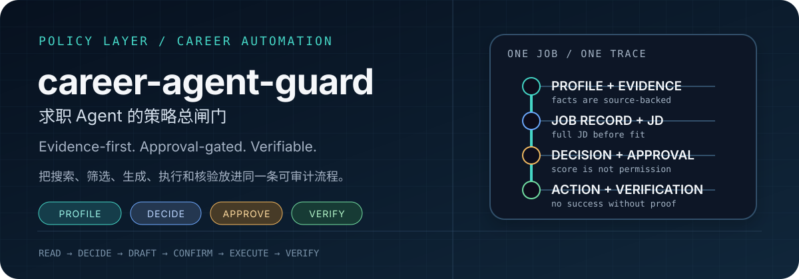
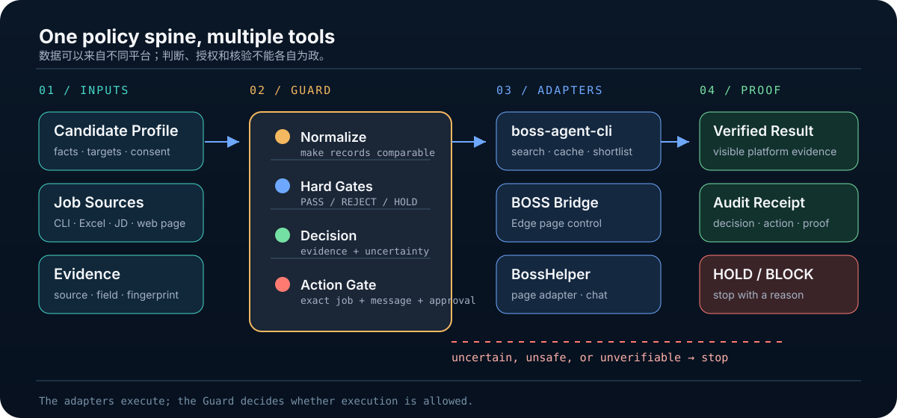
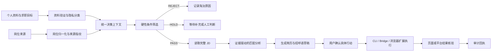
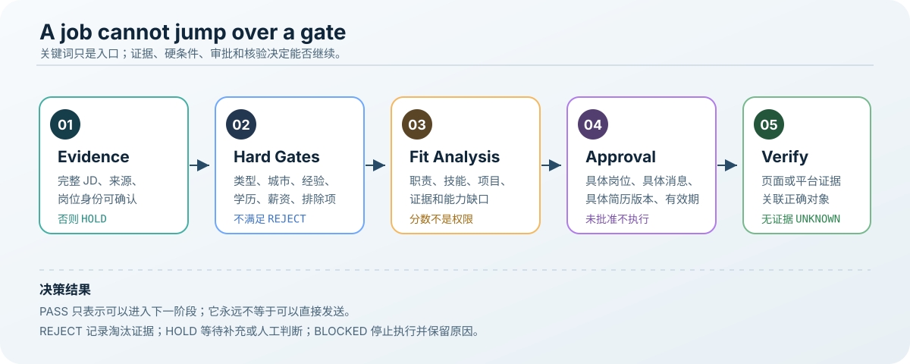
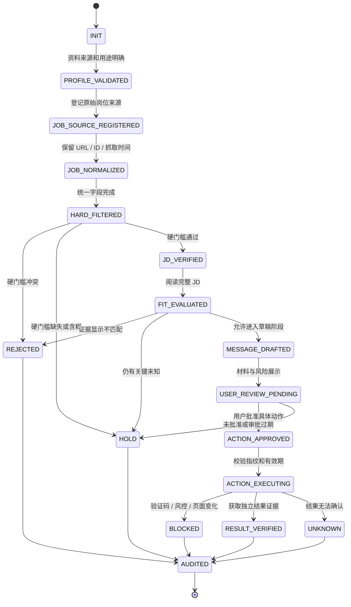
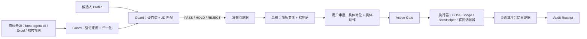
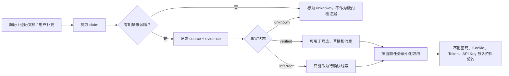
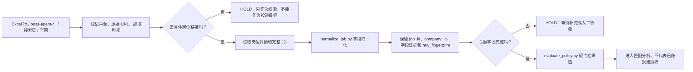
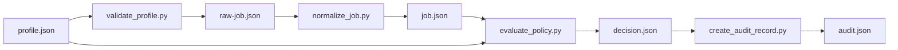
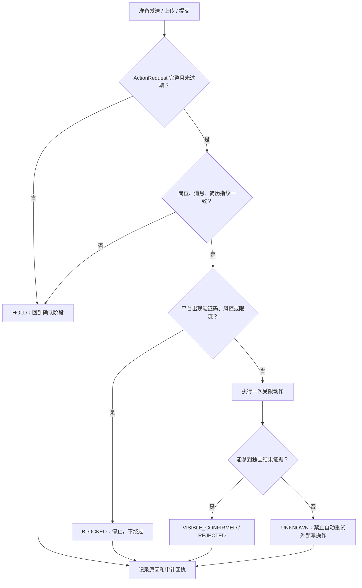

# career-agent-guard

面向求职自动化 Agent 的证据驱动、隐私最小化、审批门控约束层。

它解决的不是“如何再写一个搜索脚本”，而是如何让求职 Agent 在搜索岗位、判断匹配、生成简历和招呼语、调用浏览器工具、执行投递以及核验结果时，始终按照同一套可审计规则行动。

<p align="center">
  
</p>

> 一句话：把“我想找什么工作”和“Agent 可以做什么”拆成可验证的规则；把“看起来合适”与“允许发出去”拆成两个完全不同的状态。

## 先看结论

| 你想解决的事情 | `career-agent-guard` 负责什么 | 它不会替你做什么 |
|---|---|---|
| 从简历和目标出发筛岗位 | 把个人事实、偏好、硬约束和授权整理成版本化资料契约 | 不替你猜测没有证据的经历、学历或资格 |
| 判断岗位是否值得进入候选集 | 先做硬门槛，再读完整 JD，再输出 `PASS / REJECT / HOLD` 和证据 | 不会因为关键词命中或分数高就自动授权投递 |
| 生成针对性的简历和招呼语 | 只允许使用已核验事实，区分草稿与已发送内容 | 不负责调用招聘平台发送，也不绕过验证码或风控 |
| 连接 CLI、浏览器扩展和页面自动化 | 提供统一的策略层、Action Gate 和审计回执接口 | 不让任何工具绕过审批，不能把“点击成功”冒充“已完成” |

它最适合放在求职自动化链路的中间：上游可以是 Excel、`boss-agent-cli`、招聘官网或浏览器采集器；下游可以是 BOSS Bridge、浏览器扩展、BossHelper 或官网表单适配器；所有会产生外部写入的动作，都必须回到 Guard 进行检查。

## 适合谁？不适合谁？

适合已经有岗位来源、个人资料或多个求职工具，但担心 Agent “筛得太粗、写得太满、投得太快、结果说不清”的人。它尤其适合需要实习/校招边界、城市限制、经验上限、薪资底线、简历版本和批次上限的求职流程。

不适合把它当作“万能投递机器人”的人：这个仓库本身不是招聘网站客户端，也不包含 BOSS 登录态、账号 Cookie、个人简历或第三方模型密钥。它提供的是可以被其它工具接入的约束与证据层。

## 一眼看懂：它在整条链路中的位置



上图中的关键关系是：

- `Candidate Profile` 和 `Job Sources` 是输入，不是授权；
- `Normalize → Hard Gates → Decision` 是判断链，负责把原始资料变成有出处的 `PASS / REJECT / HOLD`；
- `Action Gate` 是写操作闸门，负责检查岗位快照、消息、简历版本、审批和有效期；
- `boss-agent-cli`、BOSS Bridge、BossHelper 和官网适配器只是执行端，不能自行决定“这个岗位是否适合”；
- `Verified Result` 和 `Audit Receipt` 是两个结果出口，只有独立证据才能让状态从 `attempted` 进入 `visible_confirmed`。

## 它解决什么问题？

求职自动化通常把几个不同问题混在一起：搜索岗位、理解 JD、判断是否适合、生成材料、点击页面按钮，以及确认操作是否真正成功。缺少统一约束时，Agent 容易出现以下问题：

- 只匹配职位关键词，不阅读完整 JD，导致岗位方向、经验要求和实习/全职类型不匹配；
- 把个人资料中的推测当成事实，夸大技能、经历、学历或项目成果；
- 把匹配分数当成投递授权，岗位“看起来合适”就直接发送消息或上传简历；
- 把“点击成功”“请求返回”误认为“已经沟通成功”；
- 搜索工具、浏览器扩展和页面自动化各自维护一套状态，重复投递或相互绕过限制；
- 将简历、账号状态、Cookie、API 密钥或个人联系方式混入日志、提示词或代码包；
- 遇到验证码、风控、页面变化或结果无法核验时仍然继续执行。

`career-agent-guard` 将这些问题拆成明确的资料契约、决策状态、审批请求、执行边界和审计回执。

## 它能解决什么痛点？

### 从“关键词筛选”变成“有证据的岗位判断”

岗位必须先经过确定性的硬性筛选，再进行 JD 匹配分析。职位类型、城市、经验、学历、薪资底线和排除条件不能被 AI 的自由发挥覆盖。

### 从“简历生成”变成“事实可追溯的简历生成”

个人经历被记录为带来源的事实。Agent 可以优化表达，但不能凭空增加职责、成果、年限或技能熟练度。

### 从“自动点击”变成“审批后执行”

搜索、读取、归一化、筛选和生成草稿可以自动完成；发送招呼语、上传简历和提交申请必须绑定到具体岗位、具体消息、具体简历版本和有限时效的审批。

### 从“执行没有回执”变成“结果可核验”

系统区分 `attempted`、`submitted`、`visible_confirmed`、`rejected`、`blocked` 和 `unknown`。只有页面或平台给出独立证据时，才报告为已完成。

### 从“工具各自为政”变成“统一策略层”

`boss-agent-cli`、BOSS 浏览器扩展和浏览器 Bridge 可以继续负责各自的技术工作，但岗位是否通过、是否允许执行以及结果是否可信，都必须回到 Guard 的统一状态。

## 它是什么，不是什么？

它是：

- 求职 Agent 的策略控制层；
- 个人资料和岗位数据的规范化层；
- 岗位决策与审批的质量门；
- 浏览器和平台写操作之前的安全闸门；
- 过程和结果的审计记录生成器。

它不是：

- BOSS、智联或公司招聘网站的搜索客户端；
- 浏览器扩展或聊天传输 SDK；
- 简历内容生成模型本身；
- 验证码、风控或平台限制的绕过工具；
- 自动收集账号密码、Cookie 或 API 密钥的工具。

## 自动化流程如何实现？



每个岗位都必须按以下状态推进，不能跳过中间的决策或审批状态：

```text
INIT
  → PROFILE_VALIDATED
  → JOB_SOURCE_REGISTERED
  → JOB_NORMALIZED
  → HARD_FILTERED
  → JD_VERIFIED
  → FIT_EVALUATED
  → MESSAGE_DRAFTED
  → USER_REVIEW_PENDING
  → ACTION_APPROVED
  → ACTION_EXECUTING
  → RESULT_VERIFIED
  → AUDITED
```

如果信息不足，结果是 `HOLD`，而不是默认通过；如果执行结果无法确认，结果是 `unknown`，而不是假定成功。



### 每一个岗位会经过什么？

| 阶段 | 输入 | Guard 要求 | 可能输出 |
|---|---|---|---|
| 0. 资料登记 | 简历、经历文档、求职目标、偏好 | 先声明来源、用途、隐私范围和版本 | `PROFILE_VALIDATED` 或缺字段清单 |
| 1. 岗位登记 | Excel 行、CLI 结果、搜索页、官网链接 | 区分搜索链接、公司链接和具体岗位链接；保留来源与抓取时间 | `JOB_SOURCE_REGISTERED` |
| 2. 岗位归一化 | 原始卡片、页面字段或 JSON | 映射成统一字段；未知字段保留为未知，不静默补齐 | `JOB_NORMALIZED` |
| 3. 硬门槛 | 岗位类型、城市、经验、学历、薪资、排除词 | 确定性规则先行；冲突即拒绝，缺失即暂缓 | `REJECT` / `HOLD` / 进入 JD 阅读 |
| 4. 完整 JD | 职位描述和字段证据 | 不能只看标题或关键词；要求能定位到职位、类型、经验、学历、城市和技能证据 | `JD_VERIFIED` |
| 5. 匹配分析 | 候选人事实 + 完整 JD | AI 可以总结和排序，但不能把推测变成事实、不能推翻硬拒绝 | `PASS` / `REJECT` / `HOLD`，并给出理由 |
| 6. 材料草稿 | 已核验事实、岗位要求、允许的简历版本 | 生成针对性简历/招呼语，但保持事实链和未满足项 | `MESSAGE_DRAFTED` / `RESUME_DRAFTED` |
| 7. 行动审批 | 具体岗位、具体消息、具体简历、平台和动作 | 生成一次性、有限批次、可过期的 `ActionRequest` | `ACTION_APPROVED` 或 `HOLD` |
| 8. 外部执行 | 已审批的 ActionRequest | 执行器只能执行请求中绑定的动作；遇到验证码、风控、页面变化立即停 | `attempted` / `blocked` / `rejected` |
| 9. 独立核验 | 页面反馈、平台状态、可保存证据 | 不以点击返回、HTTP 200 或“看起来成功”为完成依据 | `visible_confirmed` / `unknown` |
| 10. 审计 | 决策、审批、执行、核验证据 | 不放入密码、Cookie、Token、API Key 等秘密 | 审计回执 |

### 用状态机约束“不能跳步”



这个状态机解决的是“工具说自己做了，但没人知道做到哪一步”的问题。比如：`PASS` 只代表岗位通过当前筛选；`MESSAGE_DRAFTED` 只代表草稿生成；`ACTION_APPROVED` 才代表用户批准了一个精确动作；`visible_confirmed` 才代表结果有独立证据。任何一步都不能把上一个状态直接冒充成下一个状态。

### 关键决策规则

```text
硬约束冲突       -> REJECT
硬约束缺失       -> HOLD
硬约束通过       -> 读取完整 JD
完整 JD 不足     -> HOLD
AI 匹配分数高     -> 只能排序，不能授权
草稿生成完成      -> 仍然不能发送
用户批准精确动作  -> 才能创建 ActionRequest
执行结果不明确    -> UNKNOWN，禁止自动重试外部写操作
```

## 核心实现方式

### 1. 版本化的个人资料契约

`references/profile-schema.md` 将求职者资料拆成四类：

- 有来源的个人事实；
- 求职目标和偏好；
- 硬性限制和排除条件；
- 工具权限和用户授权。

每条事实都可以关联来源文件、原文位置、可信度和允许用途。密码、Cookie、令牌和 API 密钥不属于个人资料契约。

### 2. 统一的岗位记录

`references/job-record-schema.md` 将来自 CLI、Excel、搜索页面或招聘官网的岗位归一化为统一记录，保留：

- 来源平台和原始链接；
- 岗位与公司的稳定标识；
- 职位类型、城市、薪资、经验、学历；
- 完整 JD；
- 字段证据和原始数据指纹。

搜索链接、岗位链接和公司链接不会被混为一谈。

### 3. 硬性门控和匹配分析分离

`references/decision-policy.md` 规定先做确定性门控，再做 AI 或规则匹配：

```text
硬性条件不满足 → REJECT
硬性条件无法确认 → HOLD
硬性条件满足 → 进入 JD 匹配和排序
```

匹配分只能用于排序，不能直接授权发送消息或投递。

### 4. 绑定对象的 ActionRequest

任何外部写操作都必须携带具体的操作请求：

```json
{
  "action_type": "send_greeting",
  "platform": "zhipin",
  "job_id": "platform-job-id",
  "job_fingerprint": "sha256:...",
  "message_fingerprint": "sha256:...",
  "resume_variant": "ai-solutions",
  "approval_id": "approval-...",
  "expires_at": "2026-08-14T12:00:00+08:00"
}
```

如果岗位 JD、消息、简历版本、平台或审批状态发生变化，请求立即失效。

### 5. 工具适配，而不是工具越权

当前流程可以按如下方式接入已有工具：

| 组件 | 负责内容 | Guard 的作用 |
|---|---|---|
| `boss-agent-cli` | 搜索、缓存、基础筛选和候选岗位输出 | 接收统一岗位记录和决策结果 |
| `BOSS Agent Bridge` | 控制 Edge 页面、读取页面和执行限定操作 | 只接受经过审批的动作请求 |
| `BossHelper` | BOSS 页面适配、岗位详情、沟通和页面动作 | 直接发送、上传和聊天函数必须经过 Action Gate |
| `career-agent-guard` | 资料、决策、审批、核验和审计 | 作为统一策略中枢 |

## 与现有求职工具如何配合？

它不是把 CLI、扩展和浏览器再复制一遍，而是让这些工具共用同一套岗位身份、决策状态和写操作规则。推荐的组合关系如下：



接入一个具体工具时，至少要有四个明确边界：

1. **读入口**：把工具拿到的原始岗位映射成 `Normalized Job Record`，保留原始 URL、岗位 ID、抓取时间和字段证据。
2. **决策入口**：只使用 Guard 输出的 `PASS / REJECT / HOLD` 和理由；工具自己的排序分数不能取代 Guard 的硬门槛。
3. **写入口**：发送消息、上传简历、提交表单等外部写操作，只接受通过 Action Gate 的 `ActionRequest`，不能接受一个宽泛的“帮我投递”指令。
4. **核验入口**：执行器返回页面可见状态或平台证据；没有证据就返回 `unknown`，不能把无异常返回当成成功。

因此，`boss-agent-cli` 可以继续负责搜索，浏览器扩展可以继续负责页面适配，OpenCLI 或 Bridge 可以继续负责工具调度；但“是否匹配”“是否允许写入”“是否真的完成”只有 Guard 的状态可以作为事实来源。当前仓库提供的是这套规则和本地脚本，具体工具的适配器仍需单独实现。

## 个人资料怎样进入系统？

个人资料不是一段可以被模型随意改写的长文本，而是一组带来源、状态和用途的事实。处理顺序是：



### 资料字段的四个边界

| 数据类型 | 含义 | 可以做什么 | 不可以做什么 |
|---|---|---|---|
| `verified` | 能在原始文档或用户明确确认中找到的事实 | 满足筛选条件；写入允许的简历或招呼语 | 改写成更高级、但原文没有的经历 |
| `inferred` | Agent 根据材料推断出的可能结论 | 作为待确认提示，帮助用户补资料 | 直接当作学历、年限、成果或资格 |
| `unknown` | 当前材料无法确认的字段 | 触发 `HOLD`，提示补充证据 | 当成“应该满足”或默认通过 |
| 偏好/授权 | 想投什么、哪些城市、允许哪些平台和动作 | 作为筛选和执行边界 | 当成候选人的客观能力事实 |

一个最小的候选人资料示例（演示数据，不是用户真实资料）：

```json
{
  "schema_version": 1,
  "profile_id": "candidate-demo",
  "facts": [
    {
      "claim": "参与电商业务分析与 AI 决策支持",
      "source": "profile/demo-experience.docx",
      "evidence": "第 1 页，项目经历第 2 段",
      "status": "verified",
      "allowed_uses": ["screening", "resume", "message"]
    }
  ],
  "target": {
    "role_families": ["业务分析", "AI 实施", "解决方案顾问"],
    "skills": ["Excel", "SQL"],
    "employment_types": ["internship"],
    "locations": ["上海", "杭州"],
    "remote_allowed": false
  },
  "constraints": {
    "salary_floor_k": null,
    "max_required_experience_years": 2,
    "excluded_keywords": ["纯销售", "高频出差"],
    "unknown_hard_gate_action": "hold"
  },
  "resume_variants": [
    {
      "id": "ai-solutions",
      "source": "profile/resume-ai-solutions.pdf",
      "allowed_roles": ["AI 实施", "解决方案顾问"]
    }
  ],
  "consent": {
    "allowed_platforms": ["zhipin", "official-career-sites"],
    "allowed_actions": ["search", "read", "draft"],
    "require_approval_for": ["send_greeting", "submit_application", "upload_resume"],
    "max_batch_size": 5
  }
}
```

`validate_profile.py` 会检查必需字段、事实状态、目标角色、授权批次和疑似秘密字段，但不会打印资料内容。真正发送手机号、邮箱或官网表单需要的身份字段，应在执行时按最小范围提供，不要写进公开仓库或审计文件。

## 岗位怎样从原始来源变成可判断记录？

不同工具的字段名称不同，搜索结果也可能只有标题和一个搜索链接。Guard 不把它们直接当成“可投递岗位”，而是要求先登记来源、解析具体岗位、保留完整 JD，并生成稳定指纹。



规范化后的记录至少要能回答：岗位是什么、哪个公司、属于什么用工类型、在哪里、要求什么经验/学历、薪资如何、完整 JD 在哪里、每个字段的来源是什么。`source.url`、岗位 ID 和 `provenance.raw_fingerprint` 共同用于防止“审批的是 A 岗位，执行时变成 B 岗位”。

## AI 在这里做什么，不能做什么？

| AI 可以做 | AI 不能做 |
|---|---|
| 从已登记的 JD 中总结职责、技能和风险 | 用关键词命中替代完整 JD |
| 按已核验事实重写简历 bullet 和招呼语 | 凭空增加项目、成果、学历、年限或技能熟练度 |
| 对通过硬门槛的岗位做匹配解释和排序 | 把匹配分数当成发送、上传或投递授权 |
| 标出“缺少什么证据”并建议进入 `HOLD` | 把未知字段补成“应该满足” |
| 生成待用户审核的材料草稿 | 把草稿状态写成已发送、已提交或已沟通 |

因此，AI 是“分析和起草层”，不是“最终授权层”。最终授权必须由具体岗位、具体材料、具体平台、具体动作和有效期共同组成的 `ActionRequest` 给出。

## 一次完整运行示例

下面用一个虚构的实习岗位说明状态如何变化。它展示的是本地判断链，不会访问 BOSS，也不会上传简历。

### 1. 原始岗位输入

```json
{
  "source": {
    "platform": "zhipin",
    "url": "https://example.com/job/123",
    "retrieved_at": "2026-08-14T10:00:00+08:00"
  },
  "job": {
    "job_id": "123",
    "title": "业务分析实习生",
    "company": "示例科技",
    "employment_type": "internship",
    "city": "上海",
    "salary_text": "150-200元/天",
    "experience_text": "经验不限",
    "education_text": "本科",
    "jd_text": "协助业务分析、整理 Excel 数据、使用 SQL 完成基础分析，并支持 AI 工具落地。",
    "skills": ["Excel", "SQL"]
  },
  "field_evidence": {
    "job.title": "detail.title",
    "job.employment_type": "detail.jobType",
    "job.jd_text": "detail.postDescription"
  }
}
```

### 2. 硬筛结果

如果候选人的目标是上海实习、经验上限为 2 年，脚本可以得到类似结果：

```json
{
  "decision": "PASS",
  "hard_gates": [
    {"name": "employment_type", "status": "pass", "value": "internship"},
    {"name": "location", "status": "pass", "value": "上海"},
    {"name": "experience", "status": "pass", "required_years": null},
    {"name": "excluded_keywords", "status": "pass"}
  ],
  "fit_factors": {"role_hits": ["业务分析"], "skill_hits": ["excel", "sql"]},
  "fit_score": 100,
  "unknowns": [],
  "action_allowed": false,
  "action_status": "not_started"
}
```

这里最重要的是最后两行：即使 `decision` 是 `PASS`，`action_allowed` 仍然是 `false`。下一步只能生成草稿和待审批清单，不能直接调用“立刻沟通”或“提交申请”。

### 3. 审批和执行请求

只有用户确认具体岗位、具体消息、具体简历版本后，才可以构造类似下面的请求：

```json
{
  "action_type": "send_greeting",
  "platform": "zhipin",
  "job_id": "123",
  "job_fingerprint": "sha256:job-snapshot",
  "message_fingerprint": "sha256:message-draft",
  "resume_variant": "ai-solutions",
  "approval_id": "approval-one-batch",
  "expires_at": "2026-08-14T12:00:00+08:00"
}
```

执行器必须在动作前重新检查指纹、审批有效期、重复状态和平台安全状态。检查失败就返回 `HOLD` 或 `blocked`；执行后还要重新打开页面或读取平台状态，拿到独立证据才能记录 `visible_confirmed`。

## 仓库文件各自负责什么？

| 路径 | 作用 |
|---|---|
| `SKILL.md` | Agent 在每个求职任务中必须遵守的总规则、模式、流程和输出契约 |
| `references/profile-schema.md` | 候选人事实、偏好、硬约束、简历版本和授权的资料契约 |
| `references/job-record-schema.md` | 岗位来源、字段、完整 JD、字段证据和指纹的统一结构 |
| `references/decision-policy.md` | 硬门槛、`PASS / REJECT / HOLD`、匹配证据和不确定性规则 |
| `references/action-policy.md` | 外部写操作审批、幂等性、停止条件和结果状态 |
| `references/privacy-policy.md` | 数据最小化、脱敏、保留范围和禁止进入日志的秘密 |
| `references/audit-schema.md` | 一次运行、一次决策和一次执行的无秘密审计回执 |
| `scripts/validate_profile.py` | 在本地检查个人资料契约，不连接平台 |
| `scripts/normalize_job.py` | 把不同来源的原始岗位 JSON 归一化，并生成指纹 |
| `scripts/evaluate_policy.py` | 执行确定性的硬门槛和基础匹配计算，不授权外部动作 |
| `scripts/create_audit_record.py` | 从决策生成紧凑、无秘密的审计记录 |
| `assets/readme/*.svg` | README 的原生视觉说明：总架构、决策闸门和项目主视觉 |

## 快速开始

### 前置条件

- Codex 或其它能够读取 `SKILL.md` 的 Agent 运行环境；
- Python 3.10 或更高版本，用于运行仓库内的本地校验脚本；
- 不需要额外的 Python 第三方依赖；
- 如果后续接入 BOSS 或招聘官网，还需要用户自己准备已登录的浏览器、平台适配器和明确的执行授权。

### 安装 Skill：Git 克隆

直接克隆到 Codex 的 Skill 目录：

```powershell
$skill = "$env:USERPROFILE\.codex\skills\career-agent-guard"
git clone https://github.com/sitabanubanu/career-agent-guard.git $skill
```

如果目录已经存在，先备份或删除旧副本，再执行克隆。也可以下载 GitHub Release 中的 ZIP，解压后把包含 `SKILL.md` 的目录放到同一路径。

然后在 Codex 中显式使用：

```text
$career-agent-guard
```

如果用户没有选择运行模式，默认使用 `analyze`，也就是只读取、归一化、筛选、匹配和生成决策，不发送、不上传、不提交。

### 验证候选人资料

```powershell
python scripts\validate_profile.py profile.json
```

### 归一化岗位数据

```powershell
python scripts\normalize_job.py raw-job.json --output job.json
```

### 执行本地硬性筛选

```powershell
python scripts\evaluate_policy.py profile.json job.json --output decision.json
```

### 生成审计回执

```powershell
python scripts\create_audit_record.py decision.json --mode analyze --output audit.json
```

这些脚本只处理本地 JSON，不连接招聘平台，也不会上传资料。

### 推荐的本地运行顺序



对应命令：

```powershell
python scripts\validate_profile.py profile.json
python scripts\normalize_job.py raw-job.json --output job.json
python scripts\evaluate_policy.py profile.json job.json --output decision.json
python scripts\create_audit_record.py decision.json --mode analyze --output audit.json
```

这条链路的终点是一个本地决策和审计结果，而不是一次平台投递。要进入 `draft`，需要用已核验事实生成材料；要进入 `execute`，还要由用户审批具体的 `ActionRequest`，并在执行后完成独立核验。

### 下载已打包版本

不想使用 Git 的用户可以从 [GitHub Releases](https://github.com/sitabanubanu/career-agent-guard/releases) 下载 ZIP。解压后确认目录根部直接包含 `SKILL.md`、`references/` 和 `scripts/`，再把该目录复制到 `$env:USERPROFILE\.codex\skills\career-agent-guard`。

## 约束模式

| 模式 | 允许内容 | 不允许内容 |
|---|---|---|
| `observe` | 读取和检查 | 修改决策或执行外部动作 |
| `analyze` | 归一化、硬筛、匹配和排序 | 发送或提交 |
| `draft` | 生成针对性简历和招呼语草稿 | 发送、上传和提交 |
| `confirm` | 展示完整行动清单 | 在审批前执行 |
| `execute` | 执行当前批次内已批准动作 | 无限授权、绕过平台限制 |

遇到验证码、安全验证、频率限制、页面结构变化、重复岗位或结果无法核验时，必须停止当前动作。不能通过更换账号、切换自动化通道或修改请求来绕过平台控制。

### 外部写操作的停止路径



| 触发条件 | 系统动作 | 是否允许自动切换渠道继续？ |
|---|---|---|
| 验证码、安全验证、风控提示 | 停止当前动作，记录 `blocked` | 否 |
| 频率限制、重复岗位 | 停止批次或按策略等待 | 否，不能换账号规避 |
| 页面结构或表单字段变化 | 保留最后有效状态，转人工检查 | 否 |
| 岗位链接不是具体详情页 | 只保留为线索，标记 `HOLD` | 否 |
| 点击后没有可见确认 | 记录 `unknown` | 否，不能盲目重试 |
| 消息、简历或岗位快照变化 | 让旧审批失效，重新确认 | 否 |

## 隐私边界

- 不把真实简历、个人资料、账号状态或浏览器 Cookie 打包进 Skill 仓库；
- 日志和审计记录只保存必要字段、来源引用和指纹；
- 发送给模型的数据应限制在当前判断所需的最小范围；
- 任何第三方模型或外部服务调用都需要明确的数据授权；
- 用户的登录浏览器只是执行依赖，不是要被导出的数据源。

## 当前能力边界

当前仓库提供的是独立的约束 Skill、数据契约和本地校验脚本。它不会自动登录招聘网站，也不会自行完成 BOSS 投递。

| 能力层 | 当前仓库能提供 | 还需要什么 |
|---|---|---|
| 资料层 | 事实来源、状态、目标、排除条件、简历变体和授权边界 | 用户维护真实资料，并提供可引用来源 |
| 岗位层 | 来源登记、字段归一化、完整 JD 要求、指纹和硬筛 | CLI、Excel 解析器或官网适配器提供原始岗位数据 |
| 分析层 | `PASS / REJECT / HOLD`、匹配因素、不确定性和推荐简历版本 | 可选的模型或规则层进行更丰富的 JD 解释 |
| 草稿层 | 约束 Agent 只用已核验事实生成简历和招呼语草稿 | 具体的简历渲染器或消息模板 |
| 执行层 | `ActionRequest` 格式、审批、指纹、有效期和停止条件 | BOSS Bridge、浏览器扩展或官网表单适配器；它们必须调用 Action Gate |
| 核验层 | 结果状态和无秘密审计契约 | 执行器返回页面/平台的独立证据 |

要实现完整的运行时约束，还需要在具体工具的外部写入口接入相同的 Action Gate，例如：

- `boss-agent-cli` 的沟通和投递命令；
- Bridge 的页面执行接口；
- BossHelper 的直接发送、上传和聊天函数。

这样可以把“Agent 应该怎么做”的自然语言规则，进一步变成“工具实际上不能越权做什么”的程序级约束。

## 设计目标

```text
证据优先
→ 硬约束优先
→ 不确定就暂停
→ 草稿和发送分离
→ 审批绑定具体对象
→ 结果独立核验
→ 全过程可审计
```

## 致谢

本项目的流程设计和实现分析参考了以下开源项目：

- [Ocyss/boss-helper](https://github.com/Ocyss/boss-helper)：参考其 BOSS 页面数据适配、岗位任务流、岗位详情处理和沟通流程设计。
- [can4hou6joeng4/boss-agent-cli](https://github.com/can4hou6joeng4/boss-agent-cli)：参考其 CLI 搜索、岗位筛选、缓存、平台抽象、合规模式和浏览器 Bridge 设计。
- [jackwener/opencli](https://github.com/jackwener/opencli)：感谢其对 CLI 与浏览器操作自动化方向的启发。

本仓库不包含上述项目的源码副本；使用或再分发相关项目代码时，请遵守各自仓库的许可证和条款。
