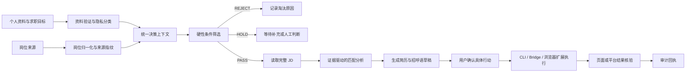

# career-agent-guard

面向求职自动化 Agent 的证据驱动、隐私最小化、审批门控约束层。

它解决的不是“如何再写一个搜索脚本”，而是如何让求职 Agent 在搜索岗位、判断匹配、生成简历和招呼语、调用浏览器工具、执行投递以及核验结果时，始终按照同一套可审计规则行动。

## 它解决什么问题？

求职自动化通常把几个不同问题混在一起：搜索岗位、理解 JD、判断是否适合、生成材料、点击页面按钮，以及确认操作是否真正成功。缺少统一约束时，Agent 容易出现以下问题：

- 只匹配职位关键词，不阅读完整 JD，导致岗位方向、经验要求和实习/全职类型不匹配；
- 把个人资料中的推测当成事实，夸大技能、经历、学历或项目成果；
- 把匹配分数当成投递授权，岗位“看起来合适”就直接发送消息或上传简历；
- 把“点击成功”“请求返回”误认为“已经沟通成功”；
- 搜索工具、浏览器扩展和页面自动化各自维护一套状态，重复投递或相互绕过限制；
- 将简历、账号状态、Cookie、API 密钥或个人联系方式混入日志、提示词或代码包；
- 遇到验证码、风控、页面变化或结果无法核验时仍然继续执行。

`career-agent-guard` 将这些问题拆成明确的资料契约、决策状态、审批请求、执行边界和审计回执。

## 它能解决什么痛点？

### 从“关键词筛选”变成“有证据的岗位判断”

岗位必须先经过确定性的硬性筛选，再进行 JD 匹配分析。职位类型、城市、经验、学历、薪资底线和排除条件不能被 AI 的自由发挥覆盖。

### 从“简历生成”变成“事实可追溯的简历生成”

个人经历被记录为带来源的事实。Agent 可以优化表达，但不能凭空增加职责、成果、年限或技能熟练度。

### 从“自动点击”变成“审批后执行”

搜索、读取、归一化、筛选和生成草稿可以自动完成；发送招呼语、上传简历和提交申请必须绑定到具体岗位、具体消息、具体简历版本和有限时效的审批。

### 从“执行没有回执”变成“结果可核验”

系统区分 `attempted`、`submitted`、`visible_confirmed`、`rejected`、`blocked` 和 `unknown`。只有页面或平台给出独立证据时，才报告为已完成。

### 从“工具各自为政”变成“统一策略层”

`boss-agent-cli`、BOSS 浏览器扩展和浏览器 Bridge 可以继续负责各自的技术工作，但岗位是否通过、是否允许执行以及结果是否可信，都必须回到 Guard 的统一状态。

## 它是什么，不是什么？

它是：

- 求职 Agent 的策略控制层；
- 个人资料和岗位数据的规范化层；
- 岗位决策与审批的质量门；
- 浏览器和平台写操作之前的安全闸门；
- 过程和结果的审计记录生成器。

它不是：

- BOSS、智联或公司招聘网站的搜索客户端；
- 浏览器扩展或聊天传输 SDK；
- 简历内容生成模型本身；
- 验证码、风控或平台限制的绕过工具；
- 自动收集账号密码、Cookie 或 API 密钥的工具。

## 自动化流程如何实现？



每个岗位都必须按以下状态推进，不能跳过中间的决策或审批状态：

```text
INIT
  → PROFILE_VALIDATED
  → JOB_SOURCE_REGISTERED
  → JOB_NORMALIZED
  → HARD_FILTERED
  → JD_VERIFIED
  → FIT_EVALUATED
  → MESSAGE_DRAFTED
  → USER_REVIEW_PENDING
  → ACTION_APPROVED
  → ACTION_EXECUTING
  → RESULT_VERIFIED
  → AUDITED
```

如果信息不足，结果是 `HOLD`，而不是默认通过；如果执行结果无法确认，结果是 `unknown`，而不是假定成功。

## 核心实现方式

### 1. 版本化的个人资料契约

`references/profile-schema.md` 将求职者资料拆成四类：

- 有来源的个人事实；
- 求职目标和偏好；
- 硬性限制和排除条件；
- 工具权限和用户授权。

每条事实都可以关联来源文件、原文位置、可信度和允许用途。密码、Cookie、令牌和 API 密钥不属于个人资料契约。

### 2. 统一的岗位记录

`references/job-record-schema.md` 将来自 CLI、Excel、搜索页面或招聘官网的岗位归一化为统一记录，保留：

- 来源平台和原始链接；
- 岗位与公司的稳定标识；
- 职位类型、城市、薪资、经验、学历；
- 完整 JD；
- 字段证据和原始数据指纹。

搜索链接、岗位链接和公司链接不会被混为一谈。

### 3. 硬性门控和匹配分析分离

`references/decision-policy.md` 规定先做确定性门控，再做 AI 或规则匹配：

```text
硬性条件不满足 → REJECT
硬性条件无法确认 → HOLD
硬性条件满足 → 进入 JD 匹配和排序
```

匹配分只能用于排序，不能直接授权发送消息或投递。

### 4. 绑定对象的 ActionRequest

任何外部写操作都必须携带具体的操作请求：

```json
{
  "action_type": "send_greeting",
  "platform": "zhipin",
  "job_id": "platform-job-id",
  "job_fingerprint": "sha256:...",
  "message_fingerprint": "sha256:...",
  "resume_variant": "ai-solutions",
  "approval_id": "approval-...",
  "expires_at": "2026-08-14T12:00:00+08:00"
}
```

如果岗位 JD、消息、简历版本、平台或审批状态发生变化，请求立即失效。

### 5. 工具适配，而不是工具越权

当前流程可以按如下方式接入已有工具：

| 组件 | 负责内容 | Guard 的作用 |
|---|---|---|
| `boss-agent-cli` | 搜索、缓存、基础筛选和候选岗位输出 | 接收统一岗位记录和决策结果 |
| `BOSS Agent Bridge` | 控制 Edge 页面、读取页面和执行限定操作 | 只接受经过审批的动作请求 |
| `BossHelper` | BOSS 页面适配、岗位详情、沟通和页面动作 | 直接发送、上传和聊天函数必须经过 Action Gate |
| `career-agent-guard` | 资料、决策、审批、核验和审计 | 作为统一策略中枢 |

## 快速开始

### 安装 Skill

将仓库复制到 Codex 的 Skill 目录：

```powershell
git clone https://github.com/sitabanubanu/career-agent-guard.git
Copy-Item -Recurse .\career-agent-guard "$env:USERPROFILE\.codex\skills\career-agent-guard"
```

然后在 Codex 中使用：

```text
$career-agent-guard
```

### 验证候选人资料

```powershell
python scripts\validate_profile.py profile.json
```

### 归一化岗位数据

```powershell
python scripts\normalize_job.py raw-job.json --output job.json
```

### 执行本地硬性筛选

```powershell
python scripts\evaluate_policy.py profile.json job.json --output decision.json
```

### 生成审计回执

```powershell
python scripts\create_audit_record.py decision.json --mode analyze --output audit.json
```

这些脚本只处理本地 JSON，不连接招聘平台，也不会上传资料。

## 约束模式

| 模式 | 允许内容 | 不允许内容 |
|---|---|---|
| `observe` | 读取和检查 | 修改决策或执行外部动作 |
| `analyze` | 归一化、硬筛、匹配和排序 | 发送或提交 |
| `draft` | 生成针对性简历和招呼语草稿 | 发送、上传和提交 |
| `confirm` | 展示完整行动清单 | 在审批前执行 |
| `execute` | 执行当前批次内已批准动作 | 无限授权、绕过平台限制 |

遇到验证码、安全验证、频率限制、页面结构变化、重复岗位或结果无法核验时，必须停止当前动作。不能通过更换账号、切换自动化通道或修改请求来绕过平台控制。

## 隐私边界

- 不把真实简历、个人资料、账号状态或浏览器 Cookie 打包进 Skill 仓库；
- 日志和审计记录只保存必要字段、来源引用和指纹；
- 发送给模型的数据应限制在当前判断所需的最小范围；
- 任何第三方模型或外部服务调用都需要明确的数据授权；
- 用户的登录浏览器只是执行依赖，不是要被导出的数据源。

## 当前能力边界

当前仓库提供的是独立的约束 Skill、数据契约和本地校验脚本。它不会自动登录招聘网站，也不会自行完成 BOSS 投递。

要实现完整的运行时约束，还需要在具体工具的外部写入口接入相同的 Action Gate，例如：

- `boss-agent-cli` 的沟通和投递命令；
- Bridge 的页面执行接口；
- BossHelper 的直接发送、上传和聊天函数。

这样可以把“Agent 应该怎么做”的自然语言规则，进一步变成“工具实际上不能越权做什么”的程序级约束。

## 设计目标

```text
证据优先
→ 硬约束优先
→ 不确定就暂停
→ 草稿和发送分离
→ 审批绑定具体对象
→ 结果独立核验
→ 全过程可审计
```

## 致谢

本项目的流程设计和实现分析参考了以下开源项目：

- [Ocyss/boss-helper](https://github.com/Ocyss/boss-helper)：参考其 BOSS 页面数据适配、岗位任务流、岗位详情处理和沟通流程设计。
- [can4hou6joeng4/boss-agent-cli](https://github.com/can4hou6joeng4/boss-agent-cli)：参考其 CLI 搜索、岗位筛选、缓存、平台抽象、合规模式和浏览器 Bridge 设计。
- [jackwener/opencli](https://github.com/jackwener/opencli)：感谢其对 CLI 与浏览器操作自动化方向的启发。

本仓库不包含上述项目的源码副本；使用或再分发相关项目代码时，请遵守各自仓库的许可证和条款。
